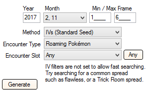
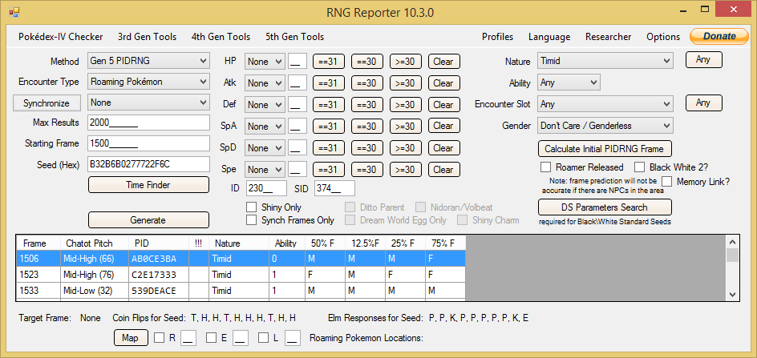
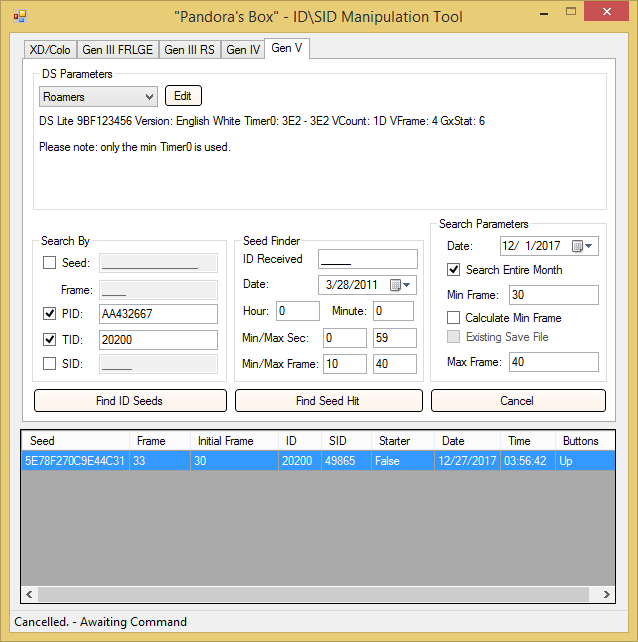
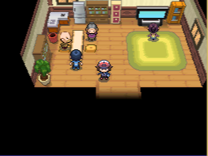
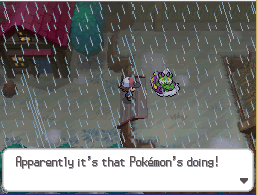
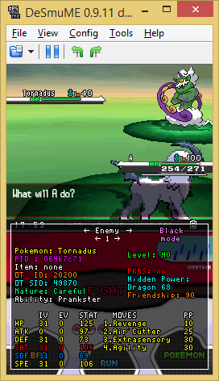
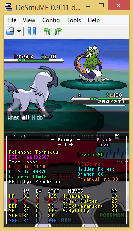

## Tools

- Desmume
  - [Setup Desmume for RNG](https://www.pokemonrng.com/desmume-setup)
- [RNG Reporter](https://github.com/Admiral-Fish/RNGReporter/releases)

## Step 1: Finding a spread

1. In RNG Reporter, set the Month to 2 and 11
2. Set the Encounter Type to Roaming Pokemon and Method as IVs (Standard Seed)
3. Make sure to set a nice IV Spread and do NOT worry about Shininess right now



```
Note: If you choose a different month, your Frames will be way more unstable/random and thus more luck-based.
```

```
Note: This should take a while.
```



## Step 2: Getting the target PID and Nature

Before we only searched for an IV spread because TID Abuse is recommend for Shiny Roamers with good IVS.

```
If you only want IVs or Shininess and not both, feel free to skip this and the next step.
```

Choose a Frame (recommended: at least 1500 Frames, perhaps 2000 if you are using a month other than 2 or 11.) Note the PID and of course, the Frame.



## Step 3: Save preperation

Similar to Generation 3 or 4 RNG Abuse, it is recommended that you TID/SID Abuse for a good Shiny. Skip this step if you only care about IVs or only care about Shininess.

1. Choose a TID/SID combo you like (Or specify a TID/SID) and get your TID/SID.
2. Hit your Initial Seed and advance frames.
3. Make sure to get your TID/SID and get to the point at which you can release the roamer.
4. Then save inside.

This is where you should save (The house on Route 7):



## Step 4: Calibration



On the original RNG Reporter Screen, you got a Frame Number, most likely between 1-6.

1. Advance frames by walking around in the house.
   - It advances every 128 Steps multiplied by the amount of Pokemon in your Party.
2. Make a Save State and walk outside. Get to the screen pictured above.
3. Start advancing frames.
4. Once you're at the target frame, press `A`.

```
Note: It will most likely not have hit your Frame. You can check your PokeDex to see if you succeeded. (Assuming you are aiming for a Shiny)
```

5. Run into the Roamer and note the PID. You can use a Lua Script to see the PID or catch it and use PkHeX to view the stats.



## Step 5: Getting the target

At this point, you should have found the PID you hit.

1. Go back to RNG Reporter.
2. In the main screen, enter your Seed and make sure it searches Generation 5 PIDRNG Abuse.
3. Hit Search and look for your PID.

```
Note: Exporting the results to .txt makes this easier, so you can use Ctrl + F to find the PID.
```

4. Find out how many frames advanced after hitting `A`, and subtract that from your target. This is your new target frame.
5. Try and hit this new target frame. If you do not hit your Pokemon
   - Repeat these steps once more.
6. You will need to repeat this multiple times, but you will prevail eventually.
7. Keep track of what Frames you have hit and what Frame you have pressed `A` on before in Notepad or Google Docs.



## Celebrate!

Catch your Roamer with a Master Ball or use a Mean Look/Arena Trap/Shadow Tag Trapper. Then, share your success with your friends or the PCalc Discord's bragging channel.
