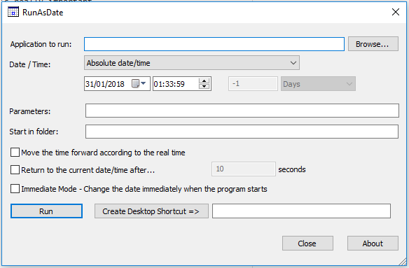

```
Note: This guide assumes that you have found your target seed. It is necessary to have your target seed before following this guide.
```

## Tools

- Desmume
  - [Setup Desmume for RNG](https://www.pokemonrng.com/desmume-setup)
- [RunAsDate](https://www.nirsoft.net/utils/run_as_date.html)
  - Take care to choose the right version (32 or 64 bits) for your computer.

### What is RunAsDate?

RunAsDate is a tool developed by nirsoft that allows any program to load with a set time specified by the user. This tool is really useful for Gen 5 RNG, and can be your best ally in order to hit your Seed without too much difficulty. Of course there are other ways, but this guide will only focus on RunAsDate.

## Step 1: Setup RunAsDate

1. Launch RunAsDate.
2. Configure RunAsDate to look like the image below.



```
Note: You'll never have to change that after. This is the universal RunAsDate configuration for RNG (Gen 3, 4 or 5), so you're almost done!
```

3. Select the program you want to fake the date/time, with the "Browse..." button.
4. Set the date and time to one of the given dates and times in PokeFinder to hit your seed.
5. After that, just hit "Run" and your desmume should be launched.

Desmume should now be running with the date and time you chose.

## Step 2: Hitting the target seed

1. Load the lua script.
2. Load your game.
3. Do any necessary keypress(es) required to hit your target seed.
4. There's nothing more to do, you can just continue as any basic RNG!

## Troubleshooting

If you're not hitting the right seed at the first try with runasdate, check to make sure these things are correct:

- Runasdate time
- RNG profile
- Keypresses needed to hit your seed
