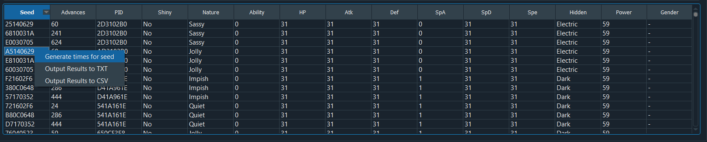
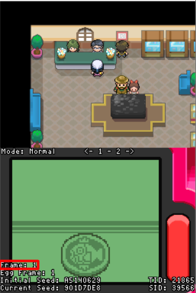

## Tools

- [PokeFinder](https://github.com/Admiral-Fish/PokeFinder/releases)
- Desmume
  - [Setup Desmume for RNG](https://www.pokemonrng.com/desmume-setup)

## Step 1: Finding your Target Advance

1. Open PokeFinder and click on the "Stationary" button in the Gen 4 column.
2. Click on "Manager" in the Profile section, then click on "New" and fill in your details like TID, SID, and the game version you are using.
   - This will only have to be done once for each profile you set up.
3. Select the profile you will be using through the dropdown besides profile.
   - If you only have one profile set up then it will be chosen by default.
4. Navigate to the "Searcher" tab and select the correct method based on what you are RNGing.

   - Method 1:

     - Starter Pokemon
     - Cynthia's Togepi Egg
     - Fossil Pokemon from Mining Museum
     - Riolu Egg from Riley
     - Eevee from Bebe
     - Porygon from Veilstone
     - Cresselia, Mesprit, Articuno, Zapdos, and Moltres
     - Pokemon Ranger Manaphy Egg

   - Method J:
     - Every other stationary which is not mentioned above like Box Art legendaries, Heatran, Regigigas, etc

5. Choose any applicable leads if you have any like Synchronize or Cute Charm.
   - Leads are not applicable for Method 1 Pokemon.
   - If you are not RNGing a genderless or gender fixed Pokemon and want to use Cute Charm, then follow the [Cute Charm guide](https://www.smogon.com/ingame/rng/dpphgss_rng_part5).
6. Adjust the filters for the Pokemon you are wanting.
   - Keep in mind there are a limited amount of possible nature and IV combinations. If there are no results for your filters, you may need to lower the IVs and/or choose a different nature.
   - If you are wanting a shiny with high IVs, you may have to RNG for a specific TID/SID first.
7. Click "Search" and wait for PokeFinder to finish searching.
8. Choose one of the results to be your target advance.
   - If there are multiple results with the same seed then you can choose any of those.

```
Note: The higher the delay, the longer the wait will be for the target initial seed. The delay advances at about 60 per second, so keep this in mind when going for higher delays.
```

## Step 2: Hitting your Initial Seed

1. Save the game in front of the Pokemon you want, or before starting the dialogue to obtain the Pokemon.
2. Right click on the seed you want in PokeFinder and click "Generate times for seed".



3. Note the date, time and delay and then proceed to follow [this guide](https://www.pokemonrng.com/dppt-initial-seed) which explains how to hit your initial seed in detail.


4. After hitting your desired seed continue on to the next step.

## Step 3: Advancing the RNG



1. The lua script should show what your RNG advance is.
   - The RNG "Frame" number shows the number of advances.

```
Note: You can ignore the "Egg Frame" shown under "Frame". It is not relevant for Diamond/Pearl/Platinum stationary RNG.
```

2. You will need to advance the RNG until it matches with the number in the "Advances" column.
   - In the below screenshot the target RNG advance is 60.


There are various ways to advance the RNG. [This explains the different methods in detail](https://www.pokemonrng.com/dppt-advance-rng). For this RNG Chatot Chatter and/or Journal flips are recommended.

## Step 4: Obtaining the desired Pokemon

Once the RNG "Frame" from the lua script matches the target advance in PokeFinder, press `A` to start the encounter, or to obtain the Pokemon.


Enjoy!


### Special Cases

**Distortion World Giratina (NOT Turnback Cave)**

- Giratina is a Method J Pokemon. Every time the Distortion World is loaded the RNG advances by 11. If you're doing advances through the Journal or Chatter your starting advance will be 23. (It will be 12 if you're advancing the RNG through the Journal without accessing it from the menu, i.e. when it first appears when starting the game).

- The recommended procedure would be to start the game (loading the Distortion World map once), open the menu, and do either Chatters or Journal flips as if the starting advance is 23, then engage in battle (loading the Distortion World map a second time).

**Cresselia/Mesprit**

- Cresselia and Mesprit are generated by Method 1 and have a starting advance of 5. Their data is generated once you talk to them and they fly off. Save in front of them and do your advances once you've confirmed your seed, then talk to them to release them. If aiming for a advance of 100 you'd need to do 100-5=95 advances through either Journal flips or Chatters before talking to them to release them.

**Kanto Birds**

- The birds are Method 1 Pokemon. Their data is generated after talking to Professor Oak and releasing them. Each bird has a different starting advance. Moltres is 1, Zapdos is 6, and Articuno is 11.

- Choose one bird (preferably Moltres) and do your seed verification and RNG advancements before releasing it. Once that's done, capture your target bird and KO the other two. Defeat the Pokemon League and head back to Oak. The remaining two birds will be generated in the same order and will have starting frames of 1 and 6, so if Moltres was caught Zapdos would now be on frame 1 and Articuno would be on frame 6. Do the usual delay hitting and RNG advancements before talking to Oak to get the next bird, catch it and KO the bird you weren't going for and do the same thing you did to revive and capture the last bird.

**Manaphy Egg**

- The Manaphy Egg is received like a Wondercard Pokemon, but it uses the Method 1 generation. The Wondercard follows the usual RNG. It has a shiny check on it that prevents the hatched Manaphy from being shiny normally, but there is a way to bypass this check and get a shiny Manaphy. You'll need to know the PID of the IV spread you're going for. Once you have it, you'll need a save file that isn't the one your Manaphy Wondercard is on, and has this PID shiny. Do the RNG manipulation and receive the Egg, and trade it to this game. Hatch it in the other game and if you did it correctly, you should now have a shiny Manaphy. To summarize, if you want a shiny Manaphy in game A:

- Find out what shiny PID you have in game A.

- Get the Egg with the same PID in game B.

- Trade the Egg from game B to game A.

- Hatch the Egg in game A.

- Congratulations, you now have a shiny Manaphy!

**Other Method 1 Pokemon**

- All of them have a starting advance of 1 but there are random NPCs who interfere with the process. It is suggested to freeze all the NPCs by opening menu, doing the advances and closing the menu a little before your target advance so you can compensate the difference with NPC movements. Starters are more difficult to do since you don't have any other method to advance the RNG and have to purely rely on random NPC movements.
