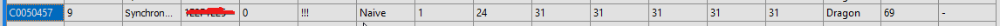
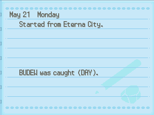
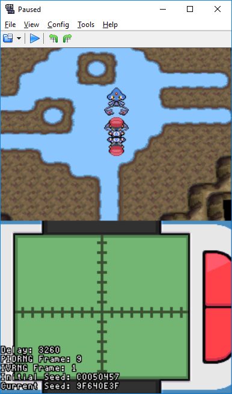
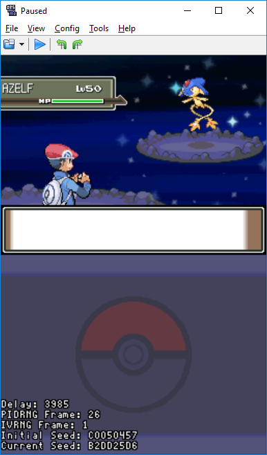

## Tools

- [PokeFinder](https://github.com/Admiral-Fish/PokeFinder/releases)
- [Desmume](http://desmume.org/download/)
- [Gen 4 Lua Scripts for your game language](https://pokerng.forumcommunity.net/?t=56443955#entry396434991)
  - The password for the lua script archive is `allyouneedisnoob`

## Step 1: Finding your Target Frame

1. Open PokeFinder and click on the "Stationary" button in the Gen 4 column.

2. Click on "Manager" in the Profile section, then click on "New" and fill in your details like TID, SID, and the game version you are using.

   - This will only have to be done once for each profile you set up.

3. Select the profile you will be using through the dropdown besides profile. If you only have one profile set up then it will be chosen by default.

4. Navigate to the "Searcher" tab and select the correct method based on what you are RNGing.

   - Method 1:

     - Starter Pokemon
     - Cynthia's Togepi Egg
     - Fossil Pokemon from Mining Museum
     - Riolu Egg from Riley
     - Eevee from Bebe
     - Porygon from Veilstone
     - Cresselia, Mesprit, Articuno, Zapdos, and Moltres
     - Pokemon Ranger Manaphy Egg

   - Method J:
     - Every other stationary which is not mentioned above like Box Art legendaries, Heatran, Regigigas, etc

5) Choose any applicable leads if you have any like Synchronize or Cute Charm (Not applicable for Method 1).

   - If you are not RNGing a genderless or gender fixed Pokemon and want to use Cute Charm, then follow the [Cute Charm guide](https://www.smogon.com/ingame/rng/dpphgss_rng_part5)

6) Adjust the filters for the Pokemon you are wanting.


The frame is something which you will be hitting inside the game and delay will be used to hit the initial seed. It is recommended that you don't choose a frame at an higher range, try to keep it below 500 as advances can be really tough. If you are unable to find any frames then you can try to increase the delay and search. The delay is the time you will be waiting at "Continue" screen while trying to hit the initial seed, this can be extended till 10k but you would need to be careful about not crossing your delay.

7. Click "Search" and wait for PokeFinder to finish searching.

8. Choose one of the results to be your target frame.
   - If there are multiple results with the same seed then you can choose any of those.

## Step 2: Hitting your Initial Seed

1. Save the game in front of the Pokemon you want.

2. Right click on the seed you want in PokeFinder and click "Generate times for seed".

3. Note the date, time and delay and then proceed to follow [this guide](https://pokemonrng.com/guides/dppt/en/Using%20Runasdate%20to%20RNG%20Initial%20Seed/) which explains how to hit your initial seed in detail.

4. After hitting your desired seed continue on to next step.

## Step 3: Advancing the PIDRNG Frame

1. The lua script should show what your PIDRNG frame is.

```
Note: You can ignore the IVRNG frame. It is not relevant for Diamond/Pearl/Platinum stationary RNG.
```

2. You will need to advance the PIDRNG frame until it matches with the number in the "Frame" column.
   - In the below screenshot the target PIDRNG frame is 9.



3. There are various ways to advance the PIDRNG frame. The next section has more details on how you can advance the PIDRNG frame.

### Methods to advance the RNG

**NPC Movement**:

- Any NPC that randomly moves, by either turning or walking, will advance the PIDRNG frame by 1 for each random movement. If an NPC does both, then the PIDRNG frame advances by 2.
- NPCs offscreen can still advance the PIDRNG frame as long as they are within the same area. Because of this, it is advised to attempt your captures in areas with little or no NPCs.
- You can stop some NPCs from randomly moving by using the VS Seeker.
- If NPC movement cannot be avoided you must press `X` to bring up the menu the moment you enter the ingame world. This freezes all NPCs in place and stops them from making any unnecessary advancements.

**Chatot Chatter**:

- For this method you must have a Chatot with the move Chatter and you must have recorded a custom Chatter to advance PIDRNG frames with this method. Afterwards, accessing Chatot's summary page will advance the PDIRNG frame by 1.
- You do not have to listen to the whole Chatter sound, simply viewing their summary is enough.
- To make things quicker you can have two Chatots next to each other in your party and flip between their summaries by pressing `Up` and `Down`.

**Character Movement**:

- Taking a step or turning in areas where you can encounter wild Pokemon (grass, water, or caves) advances the PIDRNG frame by 1 for each step or turn made.
- Walking at least 128 steps will advance the PIDRNG frame by the number of Pokemon in your party
- There is an internal step counter that starts at 0 and increases up to 128 before resetting back to 0. The step counter is always saved, therefore if you load your game and the step counter is at 127, taking one step will advance the PIDRNG frame by the number of Pokemon in your party.
- It is recommended to not use this method unless none of the other methods are an option.

**Active Roamer**:

- Having an active roamer in your game advances the initial PIDRNG frame by a different value depending on the seed.

**Journal Flips**:

- When the journal is on a page that displays `(Pokemon) was caught (Time)` like the picture below, the PIDRNG frame is advanced by 2.
- Flipping the journal to another page with a similar entry will also advance the PIDRNG frame by 2.
- As long as the journal has at least one `(Pokemon) was caught (Time)` entry, the PIDRNG frame advances by 2 regardless of how many journal entries there are.



## Step 4: Obtaining the desired Pokemon

1. Once the PIDRNG frame from the lua script matches the target PIDRNG frame in PokeFinder, press `A` to start the encounter.



5. Enjoy!



### Special Cases

**Distortion World Giratina (NOT Turnback Cave)**

- Giratina is a Method J Pokemon. Every time the Distortion World is loaded the frame advances by 11. If you're doing advances through the Journal or Chatter your starting frame will be 23 (It will be 12 if you're advancing the frame through the Journal without accessing it from the menu, i.e. when it first appears when starting the game).

- The recommended procedure would be to start the game (loading the Distortion World map once), open the menu, and do either Chatters or Journal flips as if the starting frame is 23, then engage in battle (loading the Distortion World map a second time).

**Cresselia/Mesprit**

- Cresselia and Mesprit are generated by Method 1 and have a starting frame of 5. Their data is generated once you talk to them and they fly off, so save in front of them and do your frame advances once you've confirmed your seed then talk to them to release them. If aiming for a frame of 100 you'd need to do 100-5=95 advances through either Journal flips or Chatters before talking to them to release them.

**Kanto Birds**

- The birds are Method 1 Pokemon. Their data is generated after talking to Professor Oak and releasing them. Each bird has a different starting frame i.e. Moltres is 1, Zapdos is 6 and Articuno is 11.

- Choose one bird (preferably Moltres) and do your seed verification and frame advancements before releasing it. Once that's done, capture your target bird and KO the other two. Defeat the Pokemon League and head back to Oak. The remaining two birds will be generated in the same order and will have starting frames of 1 and 6, so if Moltres was caught Zapdos would now be on frame 1 and Articuno would be on frame 6. Do the usual delay hitting and frame advancements before talking to Oak to get the next bird, catch it and KO the bird you weren't going for and do the same thing you did to revive and capture the last bird.

**Manaphy Egg**

- The Manaphy Egg is received like a Wondercard Pokemon, but it uses the Method 1 generation. The Wondercard follows the usual initial frames. It has a shiny check on it that prevents the hatched Manaphy from being shiny normally, but there is a way to bypass this check and get a shiny Manaphy. You'll need to know the PID of the IV spread you're going for. Once you have it, you'll need a save file that isn't the one your Manaphy Wondercard is on, and has this PID shiny. Do the RNG manipulation and receive the Egg, and trade it to this game. Hatch it in the other game and if you did it correctly, you should now have a shiny Manaphy. To summarize, if you want a shiny Manaphy in game A:

- Find out what shiny PID you have in game A.

- Get the Egg with the same PID in game B.

- Trade the Egg from game B to game A.

- Hatch the Egg in game A.

- Congratulations, you now have a shiny Manaphy!

**Other Method 1 Pokemon**

- All of them have starting frame of 1 but there are random NPCs who interfere with the process. It is suggested to freeze all the NPCs by opening menu, doing the advances and closing the menu a little before your target frame so you can compensate the difference with NPC movements. Starters are more difficult to do since you don't have any other method to advance your frames and have to purely rely on random NPC movements.
