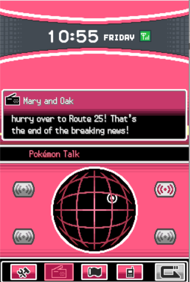

This is an explanantion of the different ways the RNG can be advanced and influenced in HeartGold and SoulSilver. The preferred method to advance the RNG is using Chatot or the Radio, though there are other methods should Chatot or the Radio not be available.

## Chatot Chatter

- For this method you must have a Chatot with the move Chatter and you must have recorded a custom Chatter to advance the RNG with this method. Afterwards, accessing Chatot's summary page will advance the RNG by 1.
- You do not have to listen to the whole Chatter sound, simply viewing their summary is enough.
- To make things quicker you can have two Chatots next to each other in your party and flip between their summaries by pressing `Up` and `Down`.

## Radio

Switching between a specific channel and no channel advances the RNG. Pokemon Talk channel advances between 14-18. Serial Radio Drama advances by 1, unless Bueno's Password is playing then it does not advance. This helps with making larger advances for both emulator and retail.

This method can be combined with other methods of advancing the RNG for more precision when near the target advance.

## Character Movement

- Taking a step or turning in areas where you can encounter wild Pokemon (grass, water, or caves) advances the RNG by 1 for each step or turn made.
- Walking at least 128 steps will advance the RNG by the number of Pokemon in your party.
- There is an internal step counter that starts at 0 and increases up to 128 before resetting back to 0. The step counter is always saved, therefore if you load your game and the step counter is at 127, taking one step will advance the RNG by the number of Pokemon in your party.
- It is recommended to not use this method unless none of the other methods are an option.

## NPC Movement

- Any NPC that randomly moves, by either turning or walking, will advance the RNG by 1 for each random movement. If an NPC does both, then the RNG advances by 2.
- NPCs offscreen can still advance the RNG as long as they are within the same area. Because of this, it is advised to attempt your captures in areas with little or no NPCs.
- If NPC movement cannot be avoided you must press `X` to bring up the menu the moment you enter the ingame world. This freezes all NPCs in place and stops them from making any unnecessary advancements.

## Active Roamer

- Having an active roamer in your game advances the initial RNG by one or two advances for each active roamer.
- These advances will need to be accounted for in determining how much to advance the RNG to reach a target advance.
- Based on the number of active roamers you have, you will want to aim for a higher minimum initial advance. Otherwise the target advance may be skipped by active roamers advancing the RNG past it.
