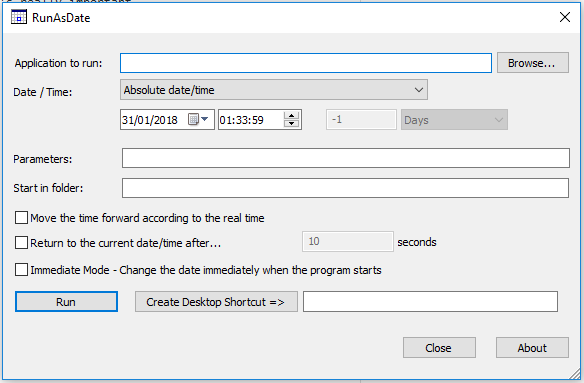

```
Note: This guide assumes that you have found a target seed already. It is necessary to have your target seed and delay before following this guide.
```

## Tools

- Desmume
  - [Setup Desmume for RNG](https://www.pokemonrng.com/desmume-setup)
- [RunAsDate](https://www.nirsoft.net/utils/run_as_date.html)
  - Take care to choose the right version (32 or 64 bits) for your computer.

### What is RunAsDate?

RunAsDate is a tool developed by nirsoft that allows any program to load with a set time specified by the user. This tool is really useful for Gen 4 RNG, and can be your best ally in order to hit your seed without difficulty.

## Setup RunAsDate

1. Launch RunAsDate.
2. Configure RunAsDate to look like the image below.



```
Note: You'll never have to change that after. This is the universal RunAsDate configuration for RNG (Gen 3, 4 or 5), so you're almost done!
```

3. Select the program you want to fake the date/time, with the "Browse..." button.
4. Set the date and time to one of the given dates and times in PokeFinder to hit your seed.
5. After that, just hit "Run" and your desmume should be launched.

## Hitting the target seed

```
Note: Make save states often during this process.
```

1. Load the lua script.
2. Click `A` to get to the "Continue" screen as fast as possible.
3. Pause your emulator `Ctrl + P`.
4. Make plenty of save states in case you mess up.
5. Unpause your game, and let it run until you get close to your target delay.
6. Once you are close, pause your emulator.
7. Create another save state (you never know what might happen!).
8. Press `N` to advance the game one video frame to increase the delay one time.
9. Once you are on the target delay, hold `A` while unpausing your game.

## Troubleshooting

Sometimes you will find that even though you are pressing A on the right delay, the actual delay you hit is +/-1 of what you wanted. This is to be expected because of how Gen 4 delays can either be always odd or always even. There are three methods to switch delays from even to odd or vice versa listed below.

### Changing the year

This is a simple method with RunAsDate. You just have to close your emulator, then change the year in RunAsDate to one year before or after the current year being used. To account for the change in year, the delay will change as well. You can verify the new delay with PokeFinder in the "Seed to Time" window by changing the year and generating the new delay. Once you've adjusted everything, you can relaunch Desmume with RunAsDate and load a save state. Then you can RNG for the new delay.

### Load a GBA game

Loading a GBA game into the GBA slot in the emulator will switch the delay from even to odd, or vice versa.

### Continue Screen

When at the screen to choose to continue your game, you can press the down arrow on the bottom touch screen to move the screen down, and then press the up arrow to move the screen back up. This will switch the delay from even to odd, or vice versa.
