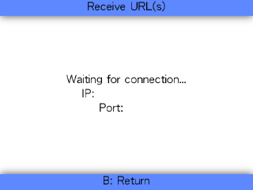

## Tools

- A 3DS with PCalc ([PCalc Install Guide](https://www.pokemonrng.com/misc-3ds-installing-pcalc))
- [3DSRNGTool](https://github.com/wwwwwwzx/3DSRNGTool/releases)

## Step 1: Save at a Location Close to the Final Screen

Save the game near the Legendary Pokémon you want to capture, such as in front of a mysterious ring, or in a town near black clouds or the huge gap in the sky.

## Step 2: Obtaining the IP address of the 3DS

1. Open FBI, then select `Remote Install`.

2. Select `Receive URLs over the network`.

3. You should see the IP address on the botton screen.

## Step 2: Launch BootNTR Selector

1. Launch the non-Mode 3 version.

2. Choose Version 3.6 when prompted.

3. Wait for the 3DS to return to the Home Menu.

## Step 4: Launch the Game

Hover over the game icon, then press `X + Y`. You should see a menu. Choose `Enable Debugger`. Usually the game will then automatically boot, if that does not happen, press `A` to boot the game. Immediately, hold `Left` and the screen will flash 3 times and wait at the loading screen.

Note: if the screen does not flash 3 times and instead boots into the game, turn off the console and on again (or use the [Rosalina menu](https://github.com/LumaTeam/Luma3DS/wiki/Rosalina) to reboot) and try again.

## Step 3: Set Up 3DSRNGTool

1. In the upper right, choose your game version.

2. If you have the Shiny Charm, check the `Shiny Charm` box.

3. Make sure you are on the `Stationary RNG` tab in 3DSRNGTool.

4. Click on `Tools`, then `NTR Helper`.

5. Enter the IP address of the 3DS in the `IP` field, then click `One Click`. The text will say "Console Connected" and the game will load.

## Step 4: Finding a Seed

1. Load into the game and pause the game using `Start + Select` when you could move your character.

2. In the 3DSRNGTool, choose the `Category`, `Pokémon`, and `Sync Nature` (if you have a Pokémon with the Synchronize Ability in the front of the party). Then select the filters you want to use in the Filters tab, such as `Shiny Only`, `Nature`, and `Hidden Power`. Make sure the `Consider Delay` box is checked in the RNG Tab. Then click `Calculate` in the RNG Info tab.

3. Take note of the Frame you want to hit based on the details provided.

- If the Frame number you chose in the 3DSRNGTool is an odd number while the Frame number shown on the 3DS is an even number, you need to unpause the game using `Start` and save the game, making the frame advances in the game to be even numbers.

- If the Frame number you chose in the 3DSRNGTool is an even number while the Frame number shown on the 3DS is an odd number, you need to unpause the game using `Start` and save the game, making the frame advances in the game to be odd numbers.

## Step 4: Reach the Final Screen

The final screen is the last screen or dialogue box before a battle with the desired Pokemon starts. A list of all the final screens can be found [here](https://github.com/wwwwwwzx/3DSRNGTool#final-screen).

For example, you should see the text "Would you like to put your hand deep in the hole?" / "Would you like to examine it? Yes/No" when interacting with the rings or "Despite that, do you want to fly into the clouds?" / "Do you want to fly into the gap? Yes/No" when Soaring in the Sky.

## Step 5: Wait for the Target Frame

1. Wait for the target Frame, and use `Start + Select` to pause the game when the frame shown on the 3DS is very close to the target Frame.

2. Use `Select` to advance 2 Frames at a time, until the Frame shown on the 3DS is the target Frame.

## Step 6: Encounter the Pokémon

Press and hold `A` to trigger the battle. Once the battle starts, you can use `Start + Left` to view the stats of the opposing Wild Pokémon to see if it matches the target Frame. Use `Start + Left` to close the window when you are done.

## Step 7: Turning Off the Console

1. After you have captured the Pokémon, save the game.

2. Click `Disconnect` in the NTR Helper window of the 3DSRNGTool. You can now successfully turn off the console.

- If you do not want to turn off the console, you can use the Rosalina menu to reboot the console.

- Do not close the game and then open the game, as the game will not boot. Press and hold `Power` to turn off the console.

## Troubleshooting

If you did not hit your target frame, use `Start + Left` to view the details of the wild Pokémon. Enter the details of the wild Pokémon in the 3DSRNGTool, then click `Calculate` to see which frame you hit.

- If it was 2 frames off, just try again.

- If it was very off, try double checking the details you entered in the 3DSRNGTool to see if they are correct.

## Additional Notes

[Video Tutorial](https://youtu.be/vAMzPPjTMSw) showing the process in-game by [im a blisy ._.](https://www.youtube.com/c/imablisy)

[PCalc Key Combos](https://gbatemp.net/threads/pcalc-usum-the-rng-plugin-for-ultra-sun-and-ultra-moon.489643/)
