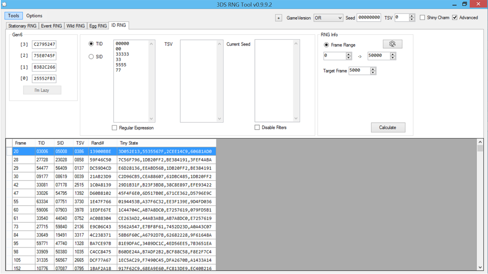
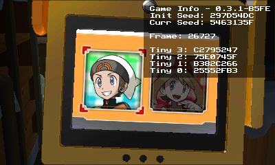
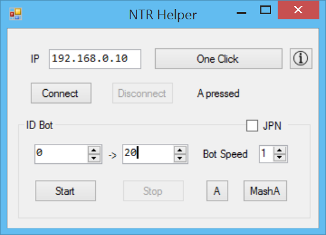
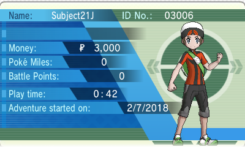
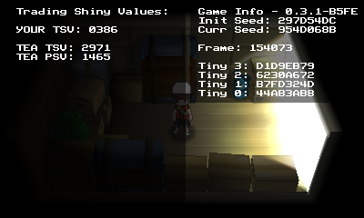

```
Note: If a save file is already present then it can be deleted by pressing `X+Y+Down` on the d-pad while at the title screen. This will delete the current save file and begin the game at the language select screen.
```

## Tools

- A 3DS with PCalc ([PCalc Install Guide](https://www.pokemonrng.com/misc-3ds-installing-pcalc))
- [3DSRNGTool](https://github.com/wwwwwwzx/3DSRNGTool/releases)
- (Optional) A network connection

## Step 1: Setup 3DSRNGTool

1. In the upper right hand corner select your game version and click the "Advance" option.
   - Seed and TSV can be blank.
2. In the ID tab fill in your desired TID, SID, or TSV.
3. 3DSRNGTool can search for multiple numbers in part or in full.
   - Finding a specific TID/SID/TSV combination will be very rare. It is advised to only RNG for one or the other.



In this example we will be getting the highlighted TID.

## Step 2: Setup the game

1. Load BootNTR Selector, then the game.
2. Select game language.
   - The bot used later on can be used for this part by selecting "Mash A" option if setup early.
3. Continue to play the game until this screen appears.



## Step 3: Advancing the frames

Every time "No" is selected when confirming name, one frame advancement happens. This can be a tedious task to complete manually, especially the higher the target frame is. A bot can be used to automatically do the frame advancement.

```
Note: If having a network connection is not possible then manually fill in the tiny seeds.
```

1. Press the home button and wait for the internet to connect.
2. In 3DSRNGTool go to Tools -> RNG Helper.
3. Fill in IP address.
   - The IP address can be found on the Rosalina screen once Input Redirection is enabled.
4. Open the Rosalina menu by pressing `L+down+select` and enable Input Redirection on the 3DS.
5. Click "One Click" to connect in RNG Helper window within 3DSRNGTool.
   - This will fill in the tiny seeds.
   - This information can be manually filled in instead.



6. Press "Calculate" in the main window to receive a list of possible frames that you can RNG for.
7. Increase or decrease range as needed.
8. If the target frame is too high or the TID/SID/TSV combination is not possible on your seed then reboot the system to start over with a different seed.
   - Rosalina can quickly reboot the system by pressing `L+Down+Select` and selecting the reboot option.

```
Note: Soft resetting the game will hard lock the system!
```

In RNG Helper window fill in the starting and ending frame.

At this point you can use the bot to advance the frames, or do it manually.

- The speed of the bot will be dependent on the stability of the 3DS to your computer.
- Increase or decrease the speed of the bot to your liking.

The bot will stop at 1 frame before the target frame.

- From there just name your character and confirm the selection.
- Wait until you can control your character to check if you got your TID/SID/TSV correct.

```
Note: Press Start + Right then Select + Left to view TSV in the seventh party slot.
```



