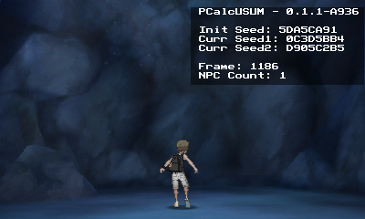
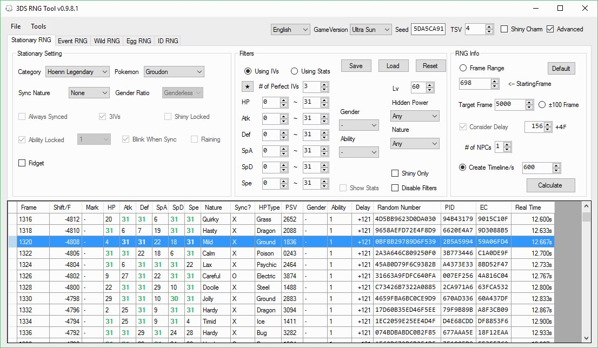
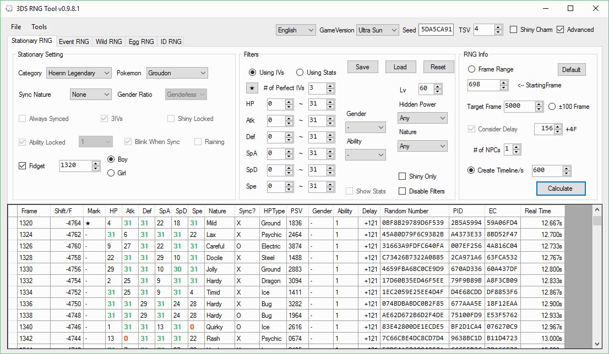

## Tools

- A 3DS with PCalc ([PCalc Install Guide](https://www.pokemonrng.com/misc-3ds-installing-pcalc))
- [3DSRNGTool](https://github.com/wwwwwwzx/3DSRNGTool/releases)

## Step 1: Create a timeline

- Follow the [timeline guide](https://www.pokemonrng.com/retail-sm-timeline) to create a timeline and find a target frame.

## Step 2: Account for character fidgeting

```
Note: This process isn't used often in Sun and Moon as it's only viable for Lunala and Solgaleo.
```

1. After calibrating a basic timeline you need to watch for your character to "fidget" and pause the game.
   - This must be the first fidget after calibrating your timeline
   - This does not have to be the first fidget when you load the game, just the first fidget after calibrating any timeline

```
Note: The NPC count is a calculation, so when the fidget happens the NPC count on the overlay will change because of the frame jump. This does not mean your base NPC count is incorrect, it is just the calculation taking the fidget into account (NPC count = max # of frames advanced - 1).
```

Boy:

 

Girl:

 

Character mid fidget:



2. Advance through the fidget using select until you notice a jump in frames that doesn't show on your timeline.
   - This will usually be 3-4 frames in the case of wormholes, as they all have 1 NPC.
   - In the example below, the frames jumped from 1320-1324, which means 1320 should be used for the fidget setting (Check the box and put it in).
3. Once entered hit Calculate and you can see the frame jump accounted for in your timeline.





Now the timeline will take character fidgeting into account for future advancements. Do not move your character and do not open the menu while advancing to your target frame.
