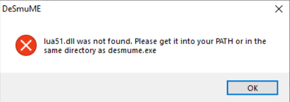

This guide is for setting up Desmume on a Windows PC. Mac and Linux users can try to use Wine to run the Desmume.exe, but this is not guaranteed to work. An updated CFW (Custom Firmware) 3DS console is required to be able to dump DS game data. There are other methods for dumping DS games, but this guide will not cover those.

## Tools

- [Desmume v0.9.11](https://sourceforge.net/projects/desmume/files/desmume/0.9.11/)
- Lua dlls
  - [64-bit](https://www.dropbox.com/s/t8yttukleqserzp/lua-dll-x64.rar?dl=0#)
  - [32-bit](https://www.dropbox.com/s/2o4hdphn7j9z349/lua-dll-x86.zip?dl=0)
- [Lua Scripts](https://github.com/DevonStudios/LuaScripts)
- A 3DS with CFW (Custom Firmware)
  - https://3ds.hacks.guide/ has instructions for installing CFW
- [Latest Godmode9](https://github.com/d0k3/GodMode9/releases)
- [Checkpoint for the 3DS](https://github.com/FlagBrew/Checkpoint/releases)

## Dumping game data

1. Select `[C:] GAMECART`.
2. Select the `.nds` file.
3. Select `Copy to 0:/gm9/out`.
4. Exit GodMode9 and transfer the `.nds` file from `sdmc:\gm9\out` to your PC.

## Extracting save

1. Load Checkpoint on the 3DS.
2. Dump the save from the DS cart.
3. The save is then stored in `sdmc:\3ds\Checkpoint\saves`.

## Setting up Desmume

1. Download both Desmume and the lua dlls.
   - You'll need either the 32-bit or the 64-bit dlls depending on which Desmume version you have (win32 or win64).
2. Place both dlls into the same folder as the Desmume executable.
3. Download the lua script for your game version.
4. Open Desmume, then under `File` choose `Open ROM`.
5. Open the `.nds` file extracted from the DS cart.
6. Under `Tools` choose `Lua Scripting`, then `New Lua Script Window...`.
7. Choose the Lua Script downloaded earlier.

Desmume should now be running with the game of your choosing, with an overlay displaying RNG information.

## Importing a save

1. Under `File` choose `Import Backup Memory...`.
2. Load the `.sav` extracted from the DS cart.

## Exporting a save

1. Under `File` choose `Export Backup Memory...`.
2. The `.sav` can be named and saved where you want it.

## Troubleshooting

### lua 51.dll was not found.

If you receive a similar error to the one above, the lua dlls are missing. Redownload the dlls and make sure they are placed into the same folder as the Desmume executable. Also, verify that the dlls match the version of Desmume you are using (32-bit or 64-bit).
