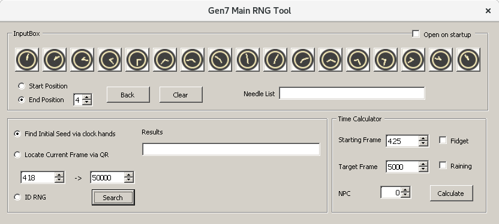
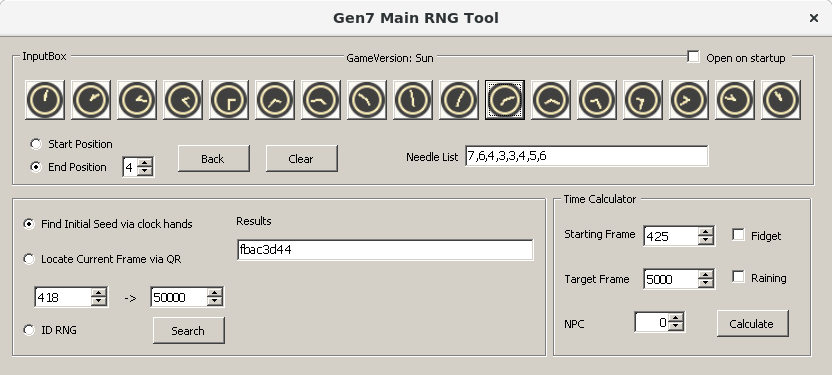

## Tools

- Video camera (your phone's camera should do)
  - Optional but it is very handy.
- [3DSRNGTool](https://github.com/wwwwwwzx/3DSRNGTool/releases)

## General principle

Each time you boot up your game, an `initial seed` (also called `seed` throughout this guide) is created. This seed can then be used to RNG abuse wild encounters, events, in-game gifts, etc.

At the "Continue" screen of the game, before your character picture loads, you can see a clock. Thanks to the clock needles position, we are going to be able to find our initial seed. The idea is to check a certain number of clocks (between 8 and 10), without restarting the game, in order to get the seed value.

Since each seed is generated when you launch the game, checking the clocks needs to be done without restarting the game. You can simply leave the "Continue" screen by pressing **B**.

## Step 1: Setup 3DSRNGTool

1. Open the 3DSRNGTool you downloaded.
2. Select your game version on the top right. ("Sun", "Moon", "Ultra Sun" or "Ultra Moon").
3. Go to "Tools" > "Gen 7 Main RNG Tool". It looks like the following picture.

4. Make sure that in the `InputBox` you have the option `End Position` selected with the number `4`.
5. Select the `Find Initial Seed via clock hands` option as well.

## Step 2: Recording the clock needles

1. Boot your 3DS and open the game. Leave it on the "Press Start" screen.

   - You can leave the animations playing, they do not influence the seed (or the frames).

2. Start recording your 3DS with your camera.
3. Press **A** or **Start** to go into the "Continue" screen.

   - Make sure you recorded the whole clock movement: from the moment you enter the "Continue" screen, until your character picture is displayed.

4. Press **B** to go back to the "Press Start" screen.
5. Repeat this process of alternating between the "Press Start" and the "Continue" screen until you get 10 clock movements.

## Step 3: Finding the seed

Once you have recorded the 10 clock movements we need to list them in the tool to get the initial seed.

1. In the `InputBox` select the clock that corresponds to the final position of each clock.

   - This End Position occurs right before the picture loads.
   - The End Position of the gif showed at the beginning is last option of the Gen7 Main RNG Tool.
   - You will see a number appear in the `Needle List` of the tool (12 for the gif demo).

2. The tool will try to find your seed after you have input 8 Needle positions.

- Sometimes you will get various results with only 8 Needles, that is why we checked 10 clocks. Enter the remaining 2 until you see a single seed.
  - The last 2 Needle positions are also useful to confirm your seed.
- If you do not have any results try checking your video again and see where you made a mistake on the Needle positions.
- If you still do not find any results, restart the game and try again recording 10 new clocks.

Your seed should appear in the `Results` field if you did everything correctly.
