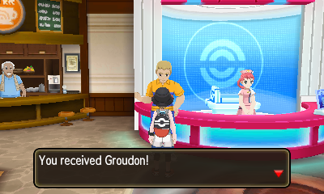

## Tools

- A 3DS with PCalc ([PCalc Install Guide](https://www.pokemonrng.com/misc-3ds-installing-pcalc))
- [3DSRNGTool](https://github.com/wwwwwwzx/3DSRNGTool/releases)

Before continuing with the guide it is recommended to be in the first PokeCenter (the one by the Pokemon School) and standing directly in front of the Delivery Man.

## Step 1: Start at the final screen

Make sure to stand exactly like the image below or the timeline may be off resulting in missing your target frame.

You should see the text: "You received xxx!"



## Step 2: Set Up 3DSRNGTool

1. In the upper right, input your game version and your TSV.

   - With PCalc, you can find your TSV by pressing `Start + Up` to bring up the Game View window. Your TSV is listed by where it says `YOUR TSV`.

2. Also in the upper right, input the initial seed. You can find this by pressing `Start + Up` to bring up the Game View window. The initial seed is found where it says `Init Seed:`.

3. If you have the Shiny Charm check the Shiny Charm box.

4. Make sure you are on the "Event RNG" tab in 3DSRNGTool.

5. If you have the WonderCard file (a .wc7) for the event you are RNGing, you can import that directly into 3DSRNGTool and have it automatically update the "Event Setting" area for you.

   - WonderCard files can be found [here](https://github.com/projectpokemon/EventsGallery).
   - Alternatively you can change the data yourself, but make sure it is correct for the event you are RNGing.

```
Note: With some events, the game will trigger a Pokedex registration animation (the same as you would catch a new Pokemon). This influences the RNG itself by changing the delay from 0 frame to 42 Frames. You can check the 'No Dex Entry' in the RNG Info in order to calibrate everything well.
```

## Step 3: RNGing the Pokemon

1. Create a timeline following this guide: [Gen 7 Timeline Guide](https://www.pokemonrng.com/retail-usum-timeline)

2. Advance to your target frame and when you land on it, press A to unpause the game and obtain the Pokemon.

Congrats! You should now have the Pokemon you wanted. If not, you can reset the game and try again.

```
Note: You can view the Pokemon's info using PCalc. Press `Start + Right` to bring up the Party View window. `Select + Right` can be used to cycle through party members with the Party View window up.
```

## Additional notes

If you did not obtain the Pokemon you wanted

1. Double check that all info has been inputted correctly, especially the initial seed.

2. Restart the guide from the beginning and make sure to follow _all_ instructions given. Not getting the correct Pokemon is usually a result of user error.

3. Make sure you are creating a timeline correctly. Skipping a target frame is usually a result of not doing a timeline correctly.
