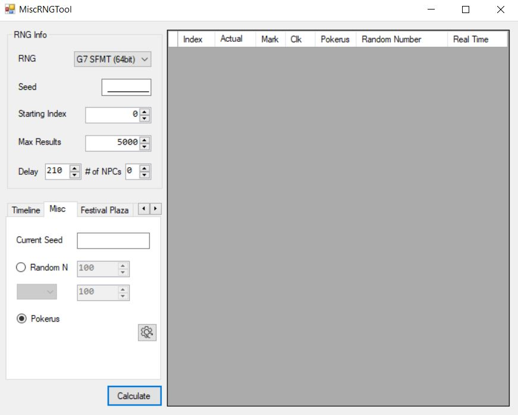
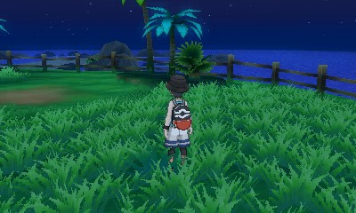
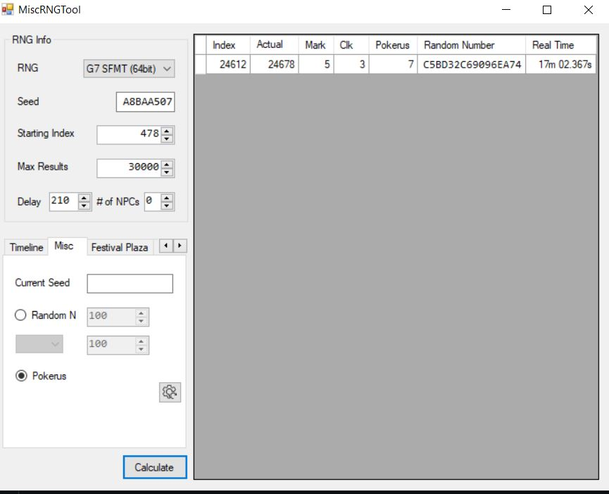
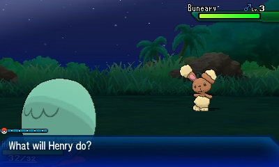
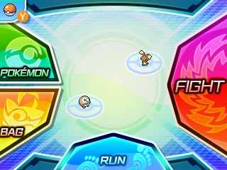
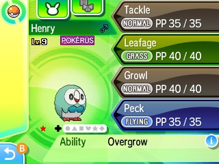
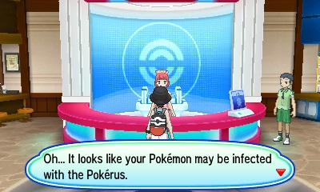

## Introduction

Pokerus RNG, while not as tough as SOS RNG, still does require some trial and error to actually get right, as the delay between running from a battle and actually hitting the target frame is not stable. It can take several tries or calibrations to actually hit the frame. The tradeoff, however, is access to one of the rarest and most beneficial mechanics in the Pokemon franchise.

## Tools

- Pokereader ([Install Guide](https://www.pokemonrng.com/install-pokereader))
  - This is the recommended tool over PCalc due to the trial and error involved. Pokereader allows for soft-resetting the game if needs be, PCalc does not.
  - [PCalc](https://www.pokemonrng.com/misc-3ds-installing-pcalc) can also be used if Pokereader is not an option for whatever reason
- [3dsrngtool](https://ci.appveyor.com/project/Bambo-Rambo/3dsrngtool/build/artifacts)

## Setup

1. Ensure your party does not currently have any Pokemon that are currently or have previously been infected with the Pokerus
 - One Pokemon in the party is sufficient. Recall that you can spread the Pokerus after you have obtained it
```
Note: If you wish to use Smoke Ball, please equip your lead with it now, before calibration. It may affect delay
```
2. (Optional) Ensure you have Festival Plaza unlocked
 - This is unlocked after entering your first Pokemon Center
3. Open 3dsrngtool, Open Tools > Misc. RNG Tool
4. Ensure RNG is set to G7 SFMT (64 Bit)
5. Set the "Delay" field to 210
6. Set "# of NPCS" to 0
```
Note: From testing, 210 seems to be the most common delay when running in USUM without a Smoke Ball. Your delay may be different, refer to the calibration field below.
```

Your screen should now look something like this: 



6. Find a patch of grass to trigger an encounter with.
 - Route 1 does nicely for this
 


## Pokerus RNG

1. Launch the game (don't open save yet), and enter your init seed into the "Seed" field for Misc. RNG Tool
2. Set "Starting Index" to 478
3. Set "Max Results" to a higher number, such as 30000
 - We can use Festival Plaza to get closer to the frame faster
4. Tab over to the "Misc." tab, and click on the "Pokerus" option.
 - The "Current Seed" field can be safely ignored.
5. Click "Calculate".



6. If the RNG tool has found a frame(s), you will see two fields: "Index" and "Actual"
 - "Index" will now be known as "Frame 1". This is the frame you will run on.
 - "Actual" will now be known as "Frame 2". This is the frame you are trying to hit.
7. Open the save file.
8. (Optional) If far away from your Frame 1, go into Festival Plaza to advance your frames much faster.
 - Come back when about ~2000 frames away from Frame 1
9. Trigger an encounter.
10. Hover over the Run button.





11. Advance to Frame 1. Press A. Pay close attention to what happens next.

```
Note: Because Timelines cannot be predicted while in Pokemon battles, it is possible that your Frame 1 will be skipped over. You should continue the attempt anyways.

Note for Pokereader users: A must be pressed down for longer than on PCalc. If you press and release too quickly, the unpause will register but the A press will not.
```

12. As soon as the screen fades to black and the Frame Counter ("Advances" in pokereader) stops advancing, take note of the frame that the RNG stops advancing on
 - This will now be known as your "Hit Frame"
 - If your Hit Frame is equivalent to your Frame 2, you now have Pokerus. Check your party members to see which one has it (chosen at random).
 - Otherwise, see the next section. Consider soft-resetting for your next attempt, instead of just triggering another encounter.
 
## Calibration

```
Warning: If you are only missing your Frame 2 by 1 or 2 frames, there is no need to calibrate. If you missed by a larger number, but only once or twice, do not calibrate. Only calibrate if you are *consistently* missing your Frame 2 by more than a few frames.
```

1. In "Starting Index", enter your Frame 1
2. In the Misc. Tab, click on the reset settings button
3. Adjust delay until "Actual" matches your Hit Frame

## Profit!

1. You can spread Pokerus to the rest of your team once you have it, until it is cured.
2. Enjoy!




