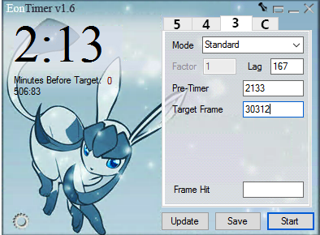
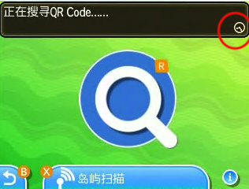

## Tools

- Calculator: [3DSRNGTool](https://github.com/wwwwwwzx/3DSRNGTool/releases)
- Timer: Any two-stage timer
  - [EonTimer 1.6](https://www.dropbox.com/s/tqf13ht2f4bxt66/EonTimer-1_6.zip?dl=0#download)
  - [Emtimer](https://emtimer.mizdra.net/SimpleTimer)
  - [ZomgTimer 2.21](https://www.dropbox.com/s/aurp9y34j5rdbhv/ZomgTimer-V2_21.jar#download)
- If you want to RNG a shiny Pokemon
  - Know your TSV. You can check your TSV via Battle Videos without Homebrew. Check [here](https://www.reddit.com/r/SVExchange/wiki/keysave)
  - Having the Shiny Charm will give you more chance to hit the shiny frame.
- At the very beginning, you may need a video camera to record the clock hands position.
- 1% luck + 99% patience!!!

## Understanding mechanics

### "Frame" and "F"

In this guide, let's call a row of 3DSRNGTool results "Frame". If you trigger the battle or receive the Pokemon at one frame number, we say we hit the frame.

"F" refers to real time: 1F = 1/60 second, which is the notation in Gen3 and in Eontimer.

### Timer setting

You can use any timer which can set two stages independently. The total time span = Pre-Timer Countdown (Part A) + Standby Time (Part B) .

- Part A: The systematic error caused by loading game, some edge frame advancement and human reaction time.
- Part B: The time of waiting from starting frame to target frame, which varies according to the seed and target frame.

## Step 1: Set Up EonTimer



We are using Gen 3 Mode of EonTimer

- Pre-Timer: in milliseconds. For example, 2133 means 2.133 seconds. - For old 3DS user, the Pre-Timer should be around 3100. For new 3DS user, the Pre-Timer should be around 2500.
- Target Frame: in F (1/60 seconds). For example, 3600 means 60 seconds. Note that EonTimer may not be so accurate since it's designed for Gen3 consoles. - **This is number different from the target frame in 3DSRNGTool** - We have to convert the Gen 7 frame into real time("F") using 3DSRNGTool
- Lag: in milliseconds. This number will add to total time.
- Frame Hit: in F. When we do calibration, we can put the frame we actually hit and click update. A new Lag will be calculated.

In summary, the total time span in seconds = (Pre-Timer + Lag) / 1000 + (Target Frame) / 60.

## Step 2: Preparation

1. Prepare a Synchronize lead, some tool Pokemon will help you catch and a bunch of balls.
2. Save in front of your target Pokemon or the person who will give you the Pokemon.
   - For legends in Wormholes, please stand as close as possible.
   - For Mystery Gifts, standing behind the delivery man in the first PC (Route 1) will have the minimum NPC number.
   - For wilds and roaming UBs, stand at specific spots with the least NPC number.

## Step 3: Set up 3DSRNGTool

1. In the upper right, input your game version and TSV. If you have the Shiny Charm, check the Shiny Charm box.
2. Set the Pokemon you are RNGing for.
   - For Stationary or Wild encounters, choose the "Category", select the "Pokemon"
     - For most of cases, you don't have to change other settings, like delay. Some RNG noise can be absorbed in Pre-Timer, don't worry.
     - If you are battling the UBs in Ultra Wormholes for the first time, choose "UB(first Encounter)". But it's not recommended because of the inconsistent delay.
   - For Mystery Gifts, change the "Event Setting" area yourself according the event you are RNGing.
     - You can find the WonderCard files (a .wc7) [here](https://github.com/projectpokemon/EventsGallery) for the event you are RNGing. Simply drag-and-drop that directly into 3DSRNGTool and have it automatically populate the settings.

## Step 4: Load your game or soft-resetting

1. L+R+Select/Start to soft reset the game.
2. Once you failed, you have to start over from step 0. Since the initial seed is different when you restart the game.

## Step 5: Find initial seed via continue screen clock needles

1. Check [here](https://www.pokemonrng.com/retail-usum-initial-seed-clocks)
2. Once you get only one seed result, the tool will update it to main window. The starting frame in Time Calculator is updated as well. (417/477 + the number of frames you saw for clocks)
3. Be sure to double check your seed, most of failures are from the wrong seed ;)
4. Do not enter your save yet.

## Step 6: Find the target frame you would like to hit

1. Set up the filters of your choosing
   - "Safe Frame Only": This box will appear for non-zero NPC case. Recommended for the initial pre-timer calibration purpose.
   - "Blink Frame Only": This box will appear for zero NPC case. Those frames can survive for around 1 seconds and super easy to hit, but they are rare.
2. Set a reasonable Frame Range, right-click on the frame you would like to hit, and Set as Target Frame.
   - Gen7 Main RNG Tool will update this simultaneously.

## Step 7: Calculate waiting time, set up timer

1. Go back to Gen Main RNG Tool. In the bottom right, everything should be updated. Hit the Calculate.
2. A message box will pop up with "Set EonTimer for XXXXF. (YY.YYs) Z;". Set XXXX as Target Frame of EonTimer. - `Z` is how long this target frame will exist. For Blink Frame, it should be above 30.

## Step 8: Press A at continue screen, start the timer at the same time

Wait at the final screen until timer ends. **Be focused!**

- For gifts or battles triggered by A pressing, proceed to the [final screen](https://github.com/wwwwwwzx/3DSRNGTool/blob/master/README.md#final-screen) as soon as possible.
- For battles triggered by one step, please open the X menu to freeze the character movement.
- For wild encounters triggered by Honey, open the X menu and hover the cursor over Bag.

## Step 9: Trigger the battle or receive the Pokemon, once the timer ends

Press A to trigger the Pokemon Generation.

- If the final input is a step, quit the X menu ~2-3 seconds before timer ends and push the circle pad hard when timer ends.
- If you are doing wild encounters, use the Honey item. Don't need to be rush, since the RNG will stop in bag.

## Step 10: If you didn't get the Pokemon

1. Adjust the Pre-Timer and restart from step 3.
2. Check `Using Stats`, put the stats of the Pokemon you got. Check `+-100 frames` in `RNG Info`, hit Calculate again, you will see the frames which have the spread you hit. If you can't find the Pokemon you hit, please make sure you got the initial seed correctly.
3. Check your pre-timer. Look at the `Shift/F` Column.
   - If the number is between -4F and 4F, you are doing good and just because of the luck. Start over again and try to find a good seed and hit frame clusters with the same spread.
   - If the number is way off like +12 for example. This means you hit the frame too late. There are two ways you can adjust the timer.
     - Decrease your pre-timer. `+ 12 / 60 * (-1000) = -200`, add that to you current Pre-Timer.
     - Put `Taget Frame + 12` into Frame Hit, Click Update, EonTimer will do the math and subtract 200 from lag.

```
Note: The Pre-Timer calibration is the key of Gen7 main RNG.
You may need to recalibrate the Pre-Timer when you change the RNG target.
```

## Additional notes

### QR method

This is a variant of above basic steps. Sometimes, we might want to hit a high frame number for perfect IVs and shiny. We can first consume tons of frames in Festival Plaza or Hau'Oli Shopping Mall.

And then check what frame you are on via the QR Scanner, since QR scanner needles also use the numbers generated from main RNG.



Go to `Gen7 Main RNG Tool`, check `Locate Current Frame via QR`, put the estimated current frame range below, input the needle sequence, until you get one result.

The Starting Frame of Time Calculator will also be updated.

So Step 4 will be press B to quit QR Scanner and start the timer at same time.

```
Note: This method is also reducing the system error of timer with long time period.
```

### Measuring NPC count

Sometimes, the results might be far away from your target, then might it's due to the NPC count required changes. Especially for Xurkitree, Magearna and standing spots of wilds.

The idea is simple, change the NPC count of Time Calculator and see what number of NPCs is giving the closet actual time you was waiting.

Or you can waiting a fixed amount of time and using QR method to check how many frames are used.

### Xurkitree

The NPC number changes between 1 and 2 in a period of 10.7 seconds due to the wandering Xurkitree in the background. So we have to use X menu to freeze the varying NPC count. Here's the mindset:

- Save while you're standing behind it
  - Which will allow you have long time window for 1 NPC (~7 seconds)
- Find the initial seed, load the game and open the X menu as soon as possible.
- Use QR needles measure NPC count to make sure there is 1 NPC.
  - Close X menu, wait several seconds and reopen it again to refresh background situation.
- Wait with X menu opened to advance close to your target frame
- Quit X menu and trigger the battle as fast as you can to avoid NPC changes.
