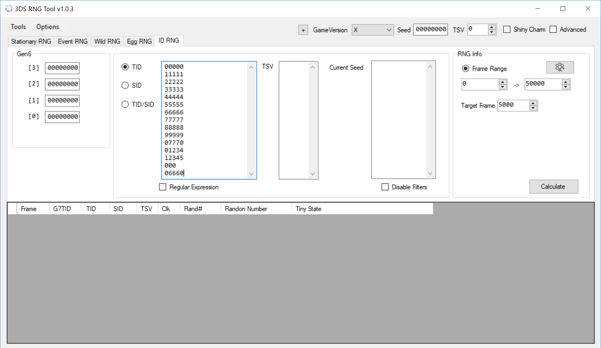
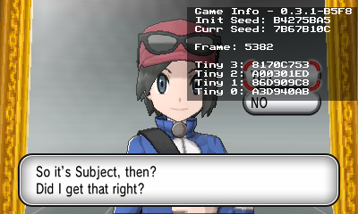
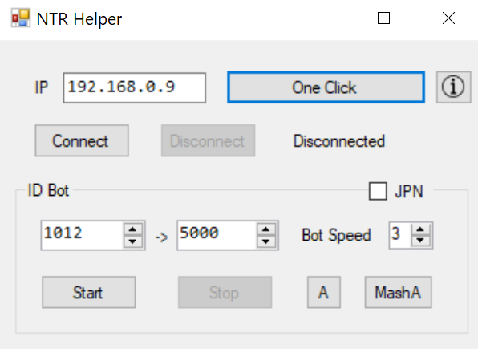
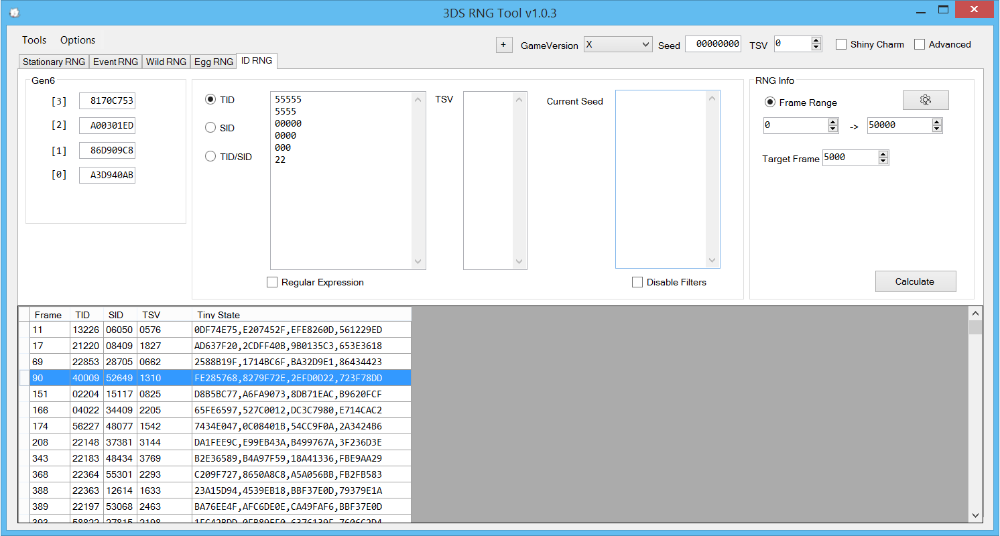
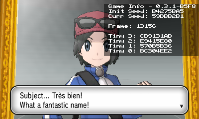
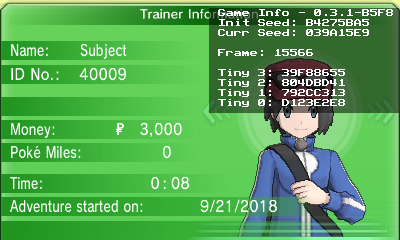

## Requirements

A new save file is needed to RNG the Trainer ID, Secret ID, or Trainer Shiny Value. If a save file is already present then it can be deleted by pressing `X + B + Up` on the d-pad while at the title screen. This will delete the current save file and begin the game at the language select screen.

Make sure to back up your save file using a save file manager such as [Checkpoint](https://github.com/FlagBrew/Checkpoint/releases) if you ever want to return to your previous save file.

## Tools

- A 3DS with PCalc ([PCalc Install Guide](https://www.pokemonrng.com/misc-3ds-installing-pcalc))
- [3DSRNGTool](https://github.com/wwwwwwzx/3DSRNGTool/releases)
- (Optional) A network connection

## Step 1: 3DSRNGTool Setup

- In the upper right hand corner select your game version and click the "Advanced" option.
  - Seed and TSV can be blank.
- In the "ID RNG" tab fill in your desired TID, SID, or TSV.
  - 3DSRNGTool can search for multiple numbers, in part or in full.
  - Finding a specific TID/SID/TSV combination will be very rare. It is advised to only RNG for one or the other.
- Under "Frame Range" start from "0".



## Step 2: Game Setup

```
Note: If you are using a N3DS or N2DSXL you can speed up the game when the PCalc overlay is active by enabling L2 cache + 804 MHz in the Rosalina menu options (Select + L + Down to bring up menu).
```

1. Load the game and connect to NTR Helper in 3DSRNGTool.

   - Instructions for doing so can be found [here].
   - If this is not possible due to not having an internet connection, then you will have to manually fill in the tiny seeds when needed later.

2. Select game language.

3. Play the game until the below screen appears.

4. Pause the game by pressing `Start + Select` at that screen.



This is the final screen to change character selection.

## Step 3: Finding a Target Frame

The "frames" in 3DSRNGTool keep track of 4 values known as "tiny seeds". The tiny seeds are used to generate trainer info such as TID, SID, and TSV. Each time the tiny seeds advance to the next set of tiny seeds a frame advancement happens. These frames are different from the frames shown in PCalc, as those frames are for a different RNG.

In X/Y the tiny seeds will constantly advance throughout the introduction. They will advance at a seemingly random pace but will be in a consistent order that 3DSRNGTool can predict.



1. Press "Calculate" in the main window to receive a list of possible frames that you can RNG for.

2. Increase or decrease range as needed. The higher the frames, the longer it will take to obtain the desired TID/SID/TSV.



_In this example we will be getting the highlighted trainer data_

3. If the target frame is too high or the TID/SID/TSV combination is not possible on your initial seed then reboot the system to start over with a different initial seed.
   - The Rosalina menu can be used to quickly reboot the system by pressing `Select + L + Down` and selecting the reboot option.

```
Note: Soft resetting the game will hard lock the system due to NTR! You must do a hard reset of the console.
```

## Step 4: Advancing the Tiny Seeds

1. Unpause the game by pressing `Start`.

2. After confirming you character selection, advance to this screen.



- This is the last screen for user input before the trainer data is generated.

3. Let the tiny seeds advance while on this final screen.

   - Pause the game using `Start + Select` to compare the tiny seeds in 3DSRNGTool every few minutes to avoid missing your target.
   - To keep track how far along the tiny seeds have advanced you can update the tiny seeds in 3DSRNGTool and press "Calculate".
   - If NTR Helper is still running then this will automatically update the tiny seeds in 3DSRNGTool.
   - Disable filters once the target frame is about 30 frames way to keep a more accurate count of frame advancements.

4. Once the wanted TID/SID/TSV is about 12 frames away from the current seeds pause the game using `Start + Select`.

5. Advance the frames and tiny seeds by pressing `Select` while the game is paused.

   - The frame counter in PCalc should advance by one for every two presses of `Select`.

6. When on the correct frame, hold `A` to make sure you unpause at that exact frame to hit the right tiny seeds.

   - Make sure to do this on the first main RNG frame of your target (TinyMT) frame.

7. Once you can control your character you can check your TID by viewing the trainer card.



```
Note: PCalc can display TSV information by pressing Start + Right and then Select + Left
```
